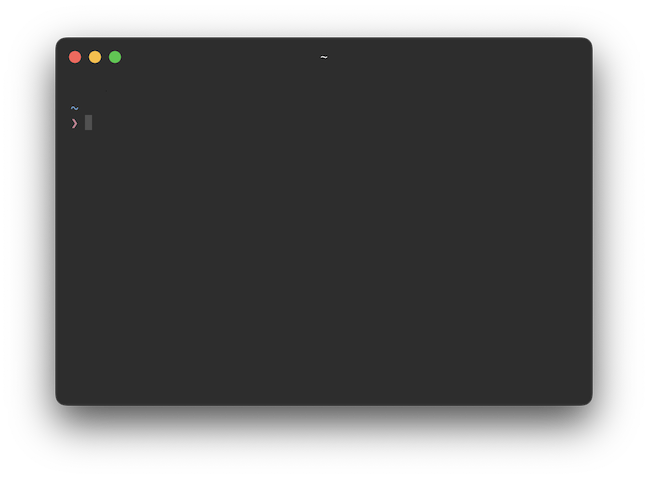

# Hyper Config



## OSX Setup

```shell
$ brew install hyper

# if the `hyper` command isn't working and "Tools" -> "Install Hyper CLI command in PATH" does nothing,
# then add this to .zshrc/.bashrc:
$ export PATH=/Applications/Hyper.app/Contents/Resources/bin/hyper:$PATH

$ hyper install hyper-tn80s

$ cp hyper.js /Users/$(whoami)/.hyper.js
```
